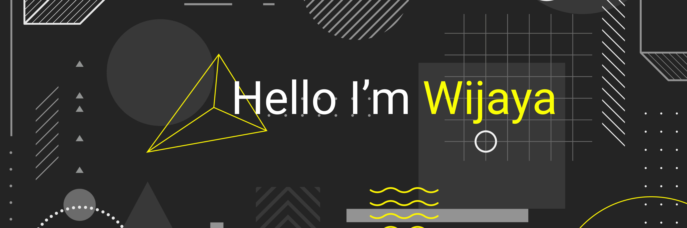

Hey there 👋

I'm Wijaya, a junior full stack developer, self taught desainer and also programmer. Now i specializes on Front End Development and also WordPress Developer.

I start my journey become programmer, because i want exploring the user need, and translate into unique website base on their value. And make sure the perfomance is blazingly fast for every situation.

Want to know more about me? [Check out my portfolio.](https://wijayaac.netlify.app)
